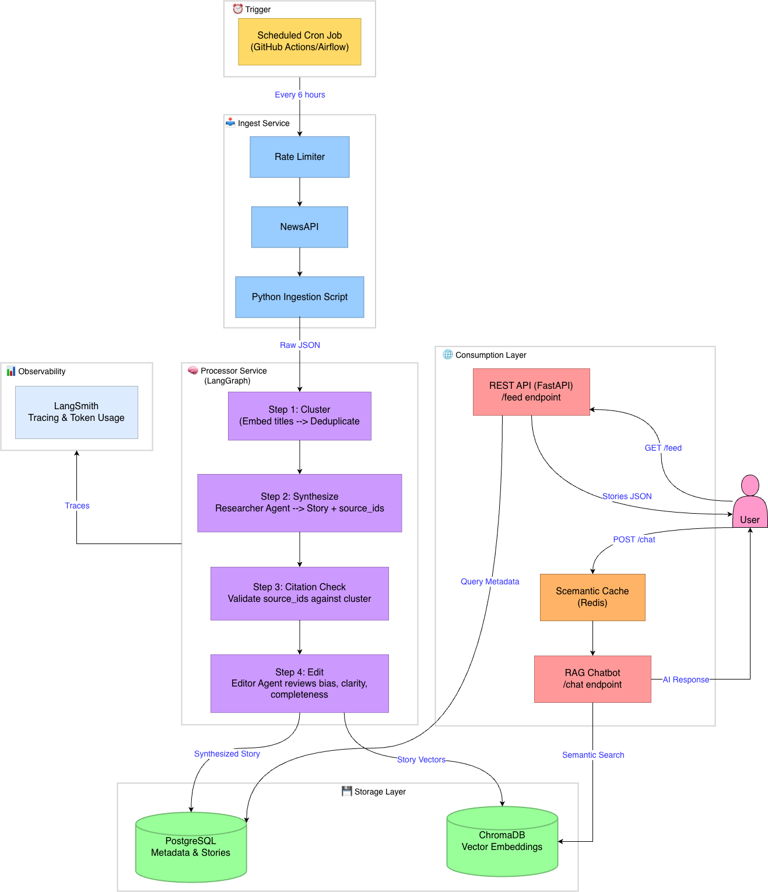

# AI News Feed — "Sentinel"

## Problem Statement
<!-- This defines "Why" we are building this. -->
**Problem**: In the age of information overload, professionals spend hours filtering through clickbait, duplicate stories, and low-quality sources to find relevant updates. Traditional aggregators (like Google News) group articles but lack depth, while simple LLM summaries often hallucinate or miss the "bigger picture" across multiple sources.

**Solution**: "Sentinel" is an autonomous, multi-agent news intelligence system. Instead of just "aggregating" links, it acts as a Research Team: it ingests raw data at scale, uses an Agentic Workflow to fact-check and synthesize different sources into a unified narrative, and allows users to "interrogate" the news via a RAG interface.

## User Personas
<!-- Who is this for? -->
- "*Market Analyst*" (**Power User**): Needs to track specific keywords (e.g., "NVIDIA supply chain") and wants a daily synthesized report, not 50 links.
- "*Deep Diver*" (**RAG User**): Reads a headline and wants to ask, "How does this compare to their Q3 performance?" using the chat interface.

## Functional Requirements
<!-- Break this down by the three pillars. -->
**A. Data Pipeline**
- **Ingestion**: Must fetch top headlines every 6 hours from **NewsAPI**. Although a single API endpoint, NewsAPI returns articles from diverse publishers (TechCrunch, The Verge, Wired, BBC, etc.), preserving multi-source diversity.
- **Rate Limiting**: Must enforce exponential backoff and a configurable crawl budget to respect upstream API rate limits (429 protection).
- **Deduplication**: Must identify that "SpaceX launches Starship" from CNN and "Starship flight successful" from BBC are the same event.
- **Storage**: Store raw JSON for archival and cleaned chunks for RAG.

**B. Multi-Agent Processor**
- **Researcher Agent**: Identifies key facts from raw articles and attaches `source_id` to every extracted claim.
- **Citation Check**: Verifies that every `source_id` returned by the Researcher exists in the current article cluster. Invalid citations are rejected before synthesis.
- **Editor Agent**: Reviews the synthesized summary for bias, clarity, and completeness.
- **Publisher Agent**: Formats the final output into Markdown/JSON.

**C. RAG & API**
- **Search**: Users can query the database with natural language.
- **Semantic Caching**: If a semantically similar query was answered recently, serve the cached response from Redis instead of paying for another LLM call.
- **Latency**: API response for standard feed retrieval must be <200ms.
- **Observability**: Every LLM token usage and cost must be tracked.

## System Architecture
1. **Trigger**: Scheduled Cron Job (via GitHub Actions/Airflow).
2. **Rate Limiter**: Token-bucket limiter with exponential backoff enforces crawl budget per run.
3. **Ingest Service**: Python script hits NewsAPI → pushes raw JSON to intermediate storage.
4. **Processor Service** (LangGraph):
    - Step 1 (Cluster): Embed titles to find duplicates.
    - Step 2 (Synthesize): Researcher Agent summarizes the cluster into one "Story," tagging every fact with its `source_id`.
    - Step 3 (Citation Check): Validates that each `source_id` maps to an article in the cluster. Rejects hallucinated citations.
    - Step 4 (Edit): Editor Agent reviews for bias, clarity, and missing sources.
5. **Storage**: Saves "Story" to PostgreSQL (metadata) and ChromaDB (vectors).
6. **Consumption**: User hits FastAPI → retrieves Story feed OR Chatbot queries ChromaDB (with Semantic Cache in front).

<!-- Visualizing the flow. -->

  

## Tech Stack Selection (Draft)
<!-- Temporary Choices. -->
- Language: Python 3.12+
- Orchestration: LangGraph (Stateful Multi-Agent)
- API: FastAPI (Async)
- Database: PostgreSQL (Metadata/Stories) + ChromaDB (Vectors)
- Cache: Redis (Semantic Caching, upgradeable to rate-limit store)
- LLM Hosting: Ollama (Local Dev) / OpenAI (Production) 
- Container: Docker + Docker Compose
- Observability: LangSmith (Tracing agent thoughts)

## Data Schema (Draft)
<!-- Data modeling -->
Table: articles (Raw inputs)
- `id`: UUID
- `source_url`: String
- `source_id`: String (publisher identifier from NewsAPI)
- `raw_content`: Text
- `ingested_at`: Timestamp

Table: stories (The AI-synthesized output)
- `id`: UUID
- `title`: String (Generated by AI)
- `summary`: Text (Generated by AI)
- `sentiment_score`: Float
- `tags`: List[String]
- `source_article_ids`: List[UUID] (Foreign Keys to articles)
- `citation_verified`: Boolean (True if all citations passed integrity check)