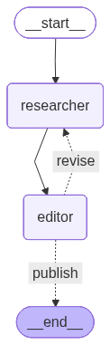
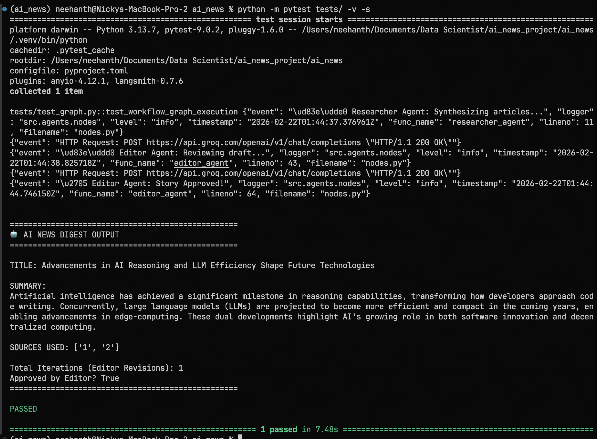

# Sentinel AI News

Sentinel AI News is an automated, AI-driven news aggregation and synthesis platform. It relies on a multi-agent workflow to fetch raw articles, analyze their content, and generate professional, cohesive daily digests.

## 🚀 Progress & Features Built So Far

The foundational backend architecture has been established, focusing on robust data ingestion and an intelligent generation pipeline.

### Core Architecture
- **Data Ingestion Service (`src/services/`):** 
  - Integrated `NewsFetcher` to pull raw articles from the NewsAPI.
  - Set up `trafilatura` for robust, raw HTML text extraction from news URLs.
- **Database & Data Modeling (`src/db/` & `src/api/`):** 
  - Configured PostgreSQL via SQLAlchemy and Alembic.
  - Defined relational models (`RawArticle`, `Story`, `StorySource`) to map inputs to AI outputs.
  - Implemented strong Pydantic schemas to validate data passing across the system.
- **Multi-Agent LangGraph Workflow (`src/agents/`):**
  - **Researcher Agent:** Uses Groq to read raw articles, synthesize facts, and draft a Markdown digest (enforcing strict structured JSON output).
  - **Editor Agent:** Acts as a quality-control guardrail, reviewing the Researcher's draft for hallucinations, bias, and tone. If the draft fails, the Editor returns it to the Researcher with specific feedback for a rewrite.
  - **State Graph:** The workflow cycles between Researcher and Editor until the draft is approved (or hits a max iteration limit).
  
  

- **Core Utilities:**
  - Implemented a centralized, customized `logger` for clean, event-based tracking across all modules.
  - Configured test suites with `pytest` to validate the LangGraph execution flow.

### Proof of Work
The multi-agent execution flow successfully taking in dummy news feeds, generating a draft, reviewing it, and outputting an organized digest:

## 🛠 Tech Stack
* **Python 3.13** (Managed by `uv`)
* **LangChain & LangGraph** (Agentic workflow orchestration)
* **Groq** (Fast LLM inference)
* **SQLAlchemy & Pydantic** (Data validation & ORM)
* **Pytest** (Testing)